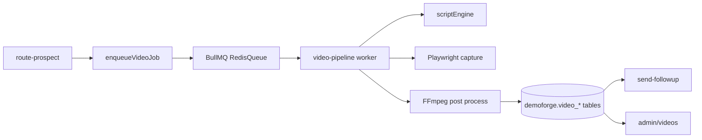

# Video Job Flow

```mermaid
flowchart LR
  routeProspect[route-prospect] --> enqueue[enqueueVideoJob]
  enqueue --> redis[BullMQ RedisQueue]
  redis --> worker[video-pipeline worker]
  worker --> script[scriptEngine]
  worker --> capture[Playwright capture]
  worker --> post[FFmpeg post process]
  post --> db[(demoforge.video_* tables)]
  db --> followup[send-followup]
  db --> admin[admin/videos]
```

## Contracts

- Queue payloads: `lib/video/contracts.ts`.
- Guardrails/flags: `lib/video/constants.ts`.
- Telemetry log wrapper: `lib/video/logging.ts`.
